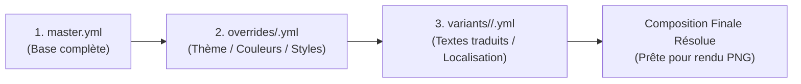

# Spécification Technique & Guide de Génération de Bundles/Templates (FrameMy.App Studio)

> **Destinataires** : Développeurs, Agents IA, Intégrations LLM automatisées.  
> **Objet** : Guide normatif complet pour générer automatiquement l'arborescence, les fichiers YAML (`master`, `overrides`, `variants`) et les ressources graphiques d'un Bundle prêt à être importé dans FrameMy.App Studio.

---

## 1. Arborescence Standard d'un Bundle

Un bundle est un dossier (ou une archive `.zip`) contenant la configuration complète d'une campagne de bannières avec ses thèmes et ses déclinaisons multilingues.

### Structure des dossiers :

```text
mon_marketing_bundle/            # Dossier racine (ou contenu direct du ZIP)
│
├── master.yml                   # [OBLIGATOIRE] Canevas de référence (dimensions, fond, calques complets)
│
├── overrides/                   # [OPTIONNEL] Surcharges thématiques / visuelles partagées
│   ├── 01_promo_flash.yml       # -> Thème promotionnel (ex: fond rouge, badge promo)
│   └── 02_dark_premium.yml      # -> Thème sombre (ex: fond sombre, typographie or)
│
├── variants/                    # [OPTIONNEL] Déclinaisons finales (textes, langues, formats)
│   ├── fr/
│   │   ├── 01_promo_flash.yml   # -> Textes traduits en Français pour le thème 01
│   │   └── 02_dark_premium.yml  # -> Textes traduits en Français pour le thème 02
│   ├── en/
│   │   ├── 01_promo_flash.yml   # -> Textes traduits en Anglais pour le thème 01
│   │   └── 02_dark_premium.yml
│   └── es/
│       └── 01_promo_flash.yml   # -> Textes traduits en Espagnol
│
└── assets/                      # [OPTIONNEL] Ressources graphiques (images, logos, textures)
    ├── logo_principal.svg       # -> Asset global accessible par toutes les déclinaisons
    ├── bg_pattern.png
    └── fr/
        └── badge_cocorico.png   # -> Asset spécifique à la langue/variante locale
```

### Règle d'association des Slugs :
Le nom de fichier sans extension est appelé le **slug** (ex: `01_promo_flash`).
- Une variante dans `variants/fr/01_promo_flash.yml` hérite **automatiquement** des propriétés de l'override `overrides/01_promo_flash.yml` s'il existe !
- Si aucun override n'a le même slug, la variante hérite directement du `master.yml`.

---

## 2. Règle Clé : Les Identifiants Sémantiques (`customId`)

Dans `master.yml`, chaque élément dispose d'un attribut **`customId`**. C'est cette clé sémantique (et non l'ID technique interne) qui sert de variable de ciblage dans les fichiers d'overrides et de variantes.

### Conventions de nommage recommandées pour une IA :
* Textes : `main_title`, `subtitle`, `cta_text`, `badge_text`, `price_tag`, `disclaimer`
* Formes & Cartes : `hero_card`, `badge_pill`, `cta_button`, `divider_line`, `accent_shape`
* Fond : ciblé via le mot-clé réservé `background` ou `bg`

---

## 3. Schéma Exhaustif des Fichiers YAML

### 3.1 Fichier Maître : `master.yml`

Le fichier maître définit l'état initial complet de la composition.

```yaml
name: "Campagne Printemps 2025"
version: "1.0"

# Cadrage et dimensions d'exportation
exportZone:
  x: 50
  y: 40
  width: 700
  height: 525
  preset: "custom"             # "custom", "square", "banner", "story", "facebook", "twitter", etc.
  ratio: 1.3333333333333333    # width / height
  targetWidth: 1200            # Largeur finale du PNG exporté
  targetHeight: 900            # Hauteur finale du PNG exporté
  lockRatio: true

# Arrière-plan du canevas
background:
  type: "linear"               # "solid", "linear", "radial", "image"
  solidColor: "rgba(79, 70, 229, 1)"
  color1: "rgba(99, 102, 241, 1)"
  color2: "rgba(236, 72, 153, 0.95)"
  angle: 135                   # Orientation en degrés (0 à 360)
  radialShape: "circle"
  radialColor1: "rgba(244, 63, 94, 1)"
  radialColor2: "rgba(30, 27, 75, 1)"
  imageUrl: ""                 # Nom du fichier dans assets/ ou URL
  imageFit: "cover"            # "cover", "contain", "auto"

# Liste ordonnée des calques (du bas vers le haut)
elements:
  # 1. Exemple d'élément Forme (Shape)
  - id: "shape-1"
    customId: "hero_card"
    type: "shape"
    shapeType: "rounded-rect"   # "rectangle", "rounded-rect", "circle", "pill", "star", "hexagon"
    x: 480
    y: 180
    width: 240
    height: 240
    rotation: 8                 # Rotation en degrés (-180 à 180)
    fillType: "linear"          # "none", "solid", "linear", "radial", "image"
    solidColor: "rgba(16, 185, 129, 0.9)"
    color1: "rgba(6, 182, 212, 0.9)"
    color2: "rgba(59, 130, 246, 0.9)"
    angle: 45
    radialColor1: "rgba(245, 158, 11, 1)"
    radialColor2: "rgba(220, 38, 38, 0.85)"
    imageUrl: ""
    opacity: 0.95               # 0.05 à 1.0
    borderRadius: 24            # Rayon d'arrondi en pixels
    stroke:
      enable: true
      width: 3
      color: "rgba(255, 255, 255, 0.9)"
    shadow:
      enable: true
      color: "rgba(0, 0, 0, 0.35)"
      blur: 16
      x: 4
      y: 8

  # 2. Exemple d'élément Texte (Text)
  - id: "txt-1"
    customId: "main_title"
    type: "text"
    text: "Offre Exclusive de Printemps"
    x: 70
    y: 120
    width: 380
    height: 90
    rotation: 0
    fontFamily: "Space Grotesk" # Polices : "Roboto", "Inter", "Poppins", "Montserrat", "Playfair Display", "DM Serif Display", "Space Grotesk", "Oswald", "Pacifico", "Lobster", "Dancing Script", "Caveat", "Cinzel"
    fontWeight: 700             # 100 à 900
    fontSize: 42
    color: "rgba(255, 255, 255, 1)"
    letterSpacing: 0
    lineHeight: 1.2
    minLines: 1
    glow:
      enable: false
      color: "rgba(59, 130, 246, 0.85)"
      blur: 16
      x: 0
      y: 0
    shadow:
      enable: true
      color: "rgba(0, 0, 0, 0.45)"
      blur: 8
      x: 2
      y: 4

  - id: "txt-2"
    customId: "cta_text"
    type: "text"
    text: "Profiter de l'offre →"
    x: 70
    y: 240
    width: 250
    height: 40
    rotation: 0
    fontFamily: "Inter"
    fontWeight: 600
    fontSize: 20
    color: "rgba(255, 255, 255, 0.95)"
    letterSpacing: 0.5
    lineHeight: 1.3
    minLines: 1
    glow:
      enable: false
      color: "rgba(0, 0, 0, 0)"
      blur: 0
      x: 0
      y: 0
    shadow:
      enable: false
      color: "rgba(0, 0, 0, 0)"
      blur: 0
      x: 0
      y: 0
```

---

### 3.2 Fichier Override : `overrides/<slug>.yml`

Les overrides servent à modifier l'apparence globale (couleurs de fond, teintes des formes, styles typographiques) pour un thème spécifique sans répéter la traduction des textes.

```yaml
name: "01 — Thème Vente Flash Rouge"
version: "1.0"

# Surcharge de l'arrière-plan
background:
  type: "linear"
  color1: "rgba(185, 28, 28, 1)"
  color2: "rgba(67, 20, 7, 1)"
  angle: 120

# Remplacement d'images éventuelles
images:
  background: "bg_flash_sale.jpg"
  hero_card: "badge_promo.png"

# Surcharge ciblée des attributs d'éléments par customId
elements:
  hero_card:
    solidColor: "rgba(239, 68, 68, 1)"
    borderRadius: 30
  cta_text:
    color: "rgba(254, 240, 138, 1)"
    fontSize: 22
```

---

### 3.3 Fichier Variante : `variants/<lang>/<slug>.yml`

Les fichiers de variantes ciblent principalement la localisation linguistique et les ajustements fins spécifiques à une langue ou un persona.

```yaml
name: "01 — Vente Flash (FR)"

# 1. Remplacement simple des textes via 'content' (syntaxe recommandée)
content:
  main_title: "Jusqu'à -50% ce week-end seulement"
  cta_text: "Commander maintenant →"

# 2. Remplacement d'image localisée si nécessaire
images:
  hero_card: "badge_fr.png"

# 3. Ajustements visuels fins si le texte traduit est plus long
elements:
  main_title:
    fontSize: 36        # Réduit pour éviter que le texte français ne déborde
    lineHeight: 1.15
```

---

## 4. Moteur de Résolution en Cascade (`resolveComposition`)

Lors de la sélection d'une variante ou lors du Batch Export, le moteur de composition applique les couches dans cet ordre strict :



1. **Master (`master.yml`)** : Charge l'intégralité du canevas (éléments complets, coordonnées, styles).
2. **Override (`overrides/<slug>.yml`)** : Écrase le fond, les styles ou les attributs d'éléments ciblés par leur `customId`.
3. **Variant (`variants/<lang>/<slug>.yml`)** :
   - Injection des textes traduits définis dans `content: { [customId]: "texte" }`.
   - Injection des images définies dans `images: { [customId]: "nom_fichier" }`.
   - Surcharges fines dans `elements: { [customId]: { fontSize: ... } }`.
4. **Résolution des Assets (`resolveAsset`)** :
   - Recherche d'abord dans le dossier localisé : `assets/<lang>/<filename>`
   - Remonte ensuite au dossier parent : `assets/<filename>`

---

## 5. Guide Opérationnel pour une IA : Comment Générer un Bundle

Pour qu'une IA produise un bundle valide sans erreur d'interprétation, elle doit respecter la checklist suivante :

### Règles d'Or :
1. **Dimensions du canevas stables** :
   - Par défaut, le canevas adopte les dimensions de `exportZone.width` et `exportZone.height` du master (ou `canvasWidth`/`canvasHeight` s'ils sont explicitement spécifiés).
   - L'ajout d'une image de fond par une variante ou un override **ne modifie pas** les dimensions du canevas, garantissant un positionnement et une échelle stables pour tous les textes et formes.
2. **Toujours définir `customId`** sur chaque élément du `master.yml`.
3. **Faire correspondre les slugs** : si le fichier override s'appelle `overrides/01_sale.yml`, les déclinaisons linguistiques doivent s'appeler `variants/fr/01_sale.yml`, `variants/en/01_sale.yml`, etc.
4. **Format des couleurs** : utiliser systématiquement des chaînes RGBA valides (ex: `"rgba(79, 70, 229, 1)"`) ou HEX.
5. **Pour les textes traduits** : préférer la syntaxe concise `content: { customId: "texte" }` plutôt que de répéter tout l'objet de l'élément.
6. **Ajuster la taille de police** (`fontSize`) si la langue cible est notoirement plus verbeuse (ex: Français ou Allemand vs Anglais).

---

## 6. Template de Prompt Système pour LLM / Agent

Copiez-collez ce prompt pour instruire une IA de générer un bundle complet :

````markdown
Tu es un générateur expert de templates de bannières pour FrameMy.App Studio.
Génère l'arborescence et les fichiers YAML complets pour une campagne publicitaire sur le thème : "[THÈME OU PRODUIT]".

Contraintes impératives :
1. Crée un fichier `master.yml` complet contenant au minimum :
   - `exportZone` (700x525 px, targetWidth: 1200, targetHeight: 900)
   - `background` (linear ou solid)
   - 2 à 4 éléments (`text` et `shape`) ayant chacun un `customId` explicite (ex: `main_title`, `subtitle`, `cta_text`, `badge_card`).
2. Crée 2 thèmes visuels dans `overrides/` :
   - `overrides/01_promo.yml`
   - `overrides/02_dark.yml`
3. Crée les déclinaisons linguistiques dans `variants/` pour `fr` et `en` :
   - `variants/fr/01_promo.yml` et `variants/fr/02_dark.yml`
   - `variants/en/01_promo.yml` et `variants/en/02_dark.yml`
4. Utilise la clé `content` pour les textes traduits et `elements` pour les adaptations de taille de police (`fontSize`).
5. Présente chaque fichier dans un bloc de code séparé avec son chemin relatif complet en en-tête.
````

---

## 7. Exemple Concret Prêt à l'Emploi : Campagne "Application Mobile Fitness"

### `master.yml`
```yaml
name: "Fitness App Launch"
version: "1.0"
exportZone:
  x: 50
  y: 40
  width: 700
  height: 525
  preset: "custom"
  ratio: 1.3333333333333333
  targetWidth: 1200
  targetHeight: 900
  lockRatio: true
background:
  type: "linear"
  solidColor: "rgba(15, 23, 42, 1)"
  color1: "rgba(30, 41, 59, 1)"
  color2: "rgba(15, 23, 42, 1)"
  angle: 140
elements:
  - id: "shape-badge"
    customId: "promo_badge"
    type: "shape"
    shapeType: "pill"
    x: 70
    y: 90
    width: 140
    height: 38
    rotation: 0
    fillType: "solid"
    solidColor: "rgba(56, 189, 248, 0.2)"
    stroke:
      enable: true
      width: 1.5
      color: "rgba(56, 189, 248, 0.8)"
    borderRadius: 999
    opacity: 1
  - id: "txt-badge"
    customId: "badge_label"
    type: "text"
    text: "NOUVEAU"
    x: 75
    y: 98
    width: 130
    height: 24
    rotation: 0
    fontFamily: "Inter"
    fontWeight: 700
    fontSize: 13
    color: "rgba(56, 189, 248, 1)"
    letterSpacing: 1.5
    lineHeight: 1.2
    minLines: 1
  - id: "txt-title"
    customId: "main_title"
    type: "text"
    text: "Atteignez vos objectifs de forme"
    x: 70
    y: 150
    width: 440
    height: 100
    rotation: 0
    fontFamily: "Space Grotesk"
    fontWeight: 700
    fontSize: 40
    color: "rgba(255, 255, 255, 1)"
    letterSpacing: -0.5
    lineHeight: 1.15
    minLines: 1
  - id: "txt-cta"
    customId: "cta_text"
    type: "text"
    text: "Commencer l'essai gratuit →"
    x: 70
    y: 280
    width: 260
    height: 40
    rotation: 0
    fontFamily: "Inter"
    fontWeight: 600
    fontSize: 18
    color: "rgba(244, 63, 94, 1)"
    letterSpacing: 0
    lineHeight: 1.3
    minLines: 1
```

### `overrides/01_intense_red.yml`
```yaml
name: "01 — Thème Énergie Rouge"
background:
  type: "linear"
  color1: "rgba(153, 27, 27, 1)"
  color2: "rgba(69, 10, 10, 1)"
  angle: 160
elements:
  promo_badge:
    solidColor: "rgba(254, 202, 202, 0.2)"
    stroke:
      color: "rgba(252, 165, 165, 0.9)"
  badge_label:
    color: "rgba(254, 226, 226, 1)"
  cta_text:
    color: "rgba(253, 224, 71, 1)"
```

### `variants/fr/01_intense_red.yml`
```yaml
name: "01 — Énergie Rouge (FR)"
content:
  badge_label: "ÉDITION 2025"
  main_title: "Dépassez vos limites au quotidien"
  cta_text: "Démarrer l'entraînement →"
elements:
  main_title:
    fontSize: 38
```

### `variants/en/01_intense_red.yml`
```yaml
name: "01 — Intense Red (EN)"
content:
  badge_label: "2025 EDITION"
  main_title: "Push beyond your limits daily"
  cta_text: "Start training now →"
elements:
  main_title:
    fontSize: 40
```
